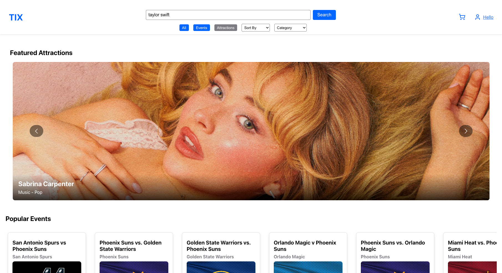

# CS4393-Project

# TIX - Modern Event Ticketing Platform

TIX is an event ticketing platform , offering a seamless experience for discovering, reviewing, and purchasing tickets for various events.

## 🎯 Key Features

- **Event Discovery**: Search and browse through a wide range of events and attractions
- **Verified Fan**: Special ticketing system to prevent scalping and ensure fair access
- **Digital Ticketing**: Seamless mobile ticket delivery and management
- **Merchandise Integration**: Purchase event-related merchandise
- **User Reviews**: Read and write authenticated reviews for events
- **Interactive Venue Maps**: Select seats with detailed venue visualization
- **Profile Management**: Track order history and manage preferences

## 🚀 Technology Stack

- **Frontend Framework**: React
- **API Integration**: Ticketmaster API for mock inventory

## 💡 Core Features Breakdown

### Verified Fan™ System
- Fan Registration: Users can register as fans of their favorite artists or attractions.
- Verification Process: Submit a request to become a verified fan with a personalized message.
- Reserved Tickets: Access to exclusive tickets reserved for verified fans.

### Event Discovery
- Search Functionality: Users can search for events using keywords, filters, and categories.
- Featured Events: Highlighted section for popular and featured events.
- Event Details: Detailed information about each event, including date, time, venue, and description.

### Merchandise Integration
- Event Merchandise: Browse and purchase official merchandise related to events and attractions. (Mock Data)

### User Reviews
- Authenticated Reviews: Users can write reviews for attraction whose events they have attended.
- Star Ratings: Aggregate star ratings for attractions based on user reviews.

### Venue Details
- Venue Information: Detailed information about the venue, including location, accessibility, and amenities.

## 🌐 Live Demo
Check out the live demo of the TIX platform at tixapp.netlify.app

## 🔮 Future Development
<input disabled="" type="checkbox"> Emails for Ticket Purchases: Send confirmation emails for ticket purchases.

<input disabled="" type="checkbox"> Ticket returns: Allow users to return tickets directly to TIX, ensuring they are not resold to prevent scalping.

<input disabled="" type="checkbox"> Event Reminders: Send reminders for upcoming events.

<input disabled="" type="checkbox"> Accessibility Improvements: Enhance accessibility features for better user experience.